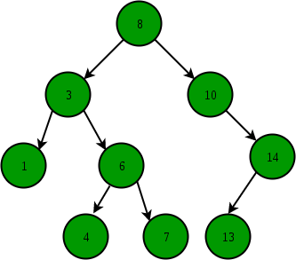

## Binary Search
Searching over a `std::vector` may take a long time especially if the value you look for is at the end. Consider the case where we store 100 unique names in a `std::vector`, where the last name is "Tuffy". If we perform a linear search (search from index 0 to the 99), it will take us 99 tries before we find "Tuffy". It will take less time to find other names, but the worst case situation is the total number of elements in the `std::vector` also called O(n) (read as Big O of n).

Binary search trees (BST) are another way of representing data to make search faster. A binary search tree is a tree composed of nodes connected with at most 2 other nodes. Each node has a value and the value of the nodes to its left should be smaller, while the nodes to its right should be larger. Below is an example of a BST.

# Product
Create a `Product` class that contains a name, a price, a pointer to a "left" Product (name occurs before the current product's name alphabetically), and a pointer to a "right" Product (name occurs affter the current product's name alphabetically). Create a constructor that will accept values for all 4 inputs. Assume that the left and right `Products` will appear before and after the `Product` alphabetically.

Implement a recursive `FindPrice` member function that accepts the name of a `Product` and returns its price. If the produce name does not match the product or any of its linked products, return -1.0.

*Not: The relational operations `<` and `>` also work for `std::string`s. For example `"apple" < "banana"` returns `true` because "apple" appears before "banana" alphabetically.* 